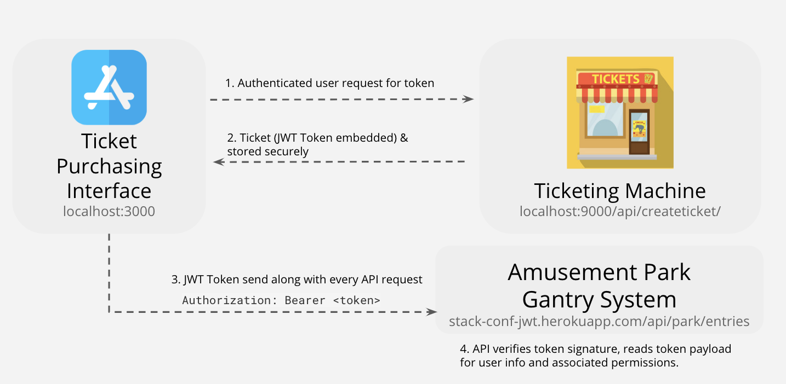

# stack-conf-exercises

The code is written in ReactJS, NodeJS and Express for STACK Developer Conference 2018.

# Exercise 1
Make a GET call to the `/verifytoken` endpoint.

## Setup
- `git clone` this library
- Restore dependencies with `npm install`
- Run `npx nodemon` 
- The server will be running on `http://localhost:9000/`

## Todo
1. Use Postman (https://www.getpostman.com/) to make a GET request http://localhost:9000/verifytoken

You should get the error: `No authorisation header found.`

2. The server is expecting an authorisation header with a JWT. Get the jwt from `bit.ly/jwt-ex-1`

3. Copy the JWT and add a Authorisation header: Bearer {JWT} to your request

You should get the error: `Oops, you are NOT authorised to view this page because: invalid signature`

4. Seems like the secret is wrong. Paste the correct secret into jwt.io to regenerate a new JWT

5. Use the correct JWT to make the request again

You should get the error: `Oops, you are NOT authorised to view this page because: jwt expired`

6. Seems like the jwt has expired. Adjust the `exp` field in jwt.io and try again.

7. You should get `Congrats, you are authorised to view this page.`

# Exercise 2
This repo contains a **Ticket Purchasing Interface** (localhost:3000) and a **Ticketing Machine** (authorisation server at localhost:9000) which creates a JWT token. 

To enter the Amusement Park, the user needs to pass the correct JWT generated by the Ticketing Machine to the **Amusement Park Gantry** in order to be allowed access in. 

Sign your own jwt using this library (https://github.com/auth0/node-jsonwebtoken) and use it to make a request to the Amusement Park Gantry server at localhost:9000. 

## Setup
- `git clone` this library

### Setup Ticketing Machine Server
Restore dependencies with `npm install`
Run `npx nodemon` to start the ticketing machine server
The ticketing machine will be running on `http://localhost:9000/`

### Setup Ticket Purchasing Interface
Open a new terminal and `cd client`
Restore dependencies with `npm install`
Then run `npm start` to run the client interface
Access the client interface on `http://localhost:3000/` 

## Structure
- `~/client` contains the React app and frontend assets
- `~/server` contains the express server and its apis

## Todo
Help fix the broken ticketing machine for an amusement park.

1. Update the code in `routes/create.js` with JWT configuration options to be:

- Algorithm - HS384
- expiresIn - 1 hour

This ensures that we are using HS284 algorithm to sign the JWT and that the JWT should expire in 1 hour.

2. Start ticketing server (http://localhost:9000) and visit http://localhost:3000 to view create ticket page

3. Click Create Ticket’ to generate a ticket. You should be able to see your ticket generated.

4. Test out your generated ticket against the amusement park gantry system. By clicking 'Insert Ticket into Gantry', We make an API request to `stack-conf-jwt.herokuapp.com/api/park/entries`.

5. We should get an error which says that certain claims are missing. 

6. Fix it by configuring the correct claims in the code payload:

- Issuer - 'stackconf-auth-service'
- Audience - 'stackconf-api-service'
- Subject - 'yourname'
- Type: 'VIP ticket'

7. Click ‘Insert Ticket into Gantry’ to send your JWT token and gain entry to the amusement park.

## Food for thought - Questions to think about:
1. How do I use a private/public key pair instead of using HMAC? What would have to change?
2. What happens if the expiration time is longer/shorter?
3. What happens if i want to revoke the access?
